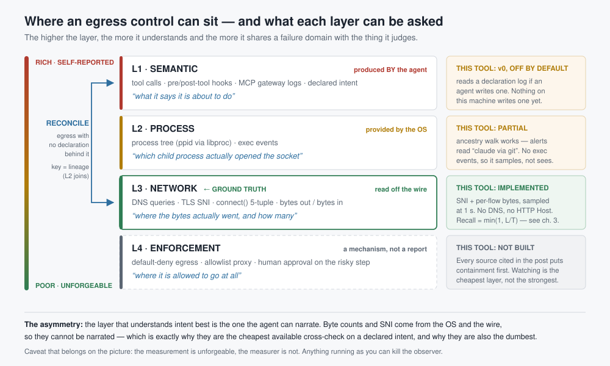
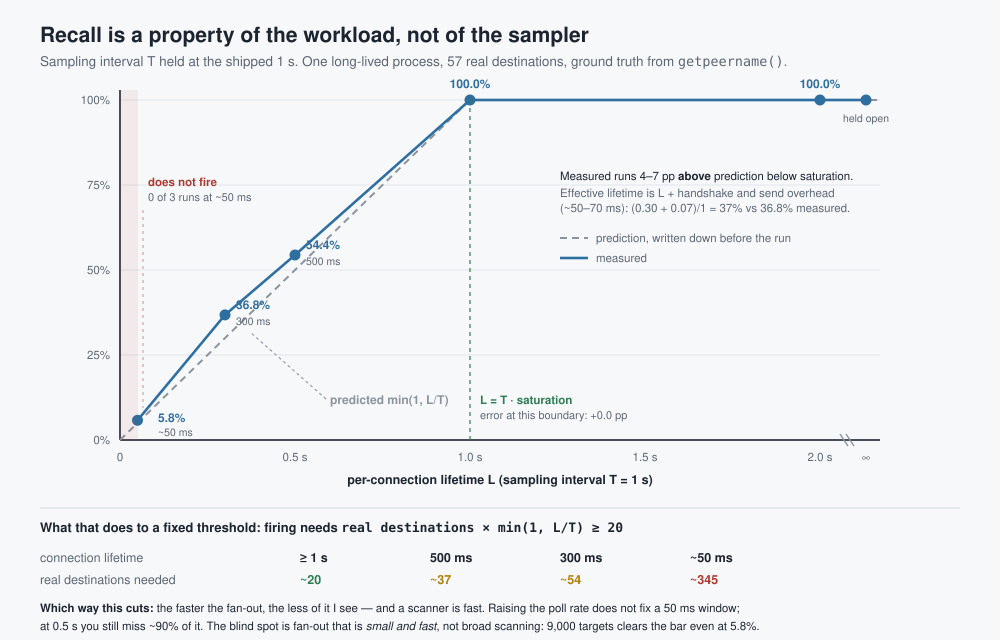
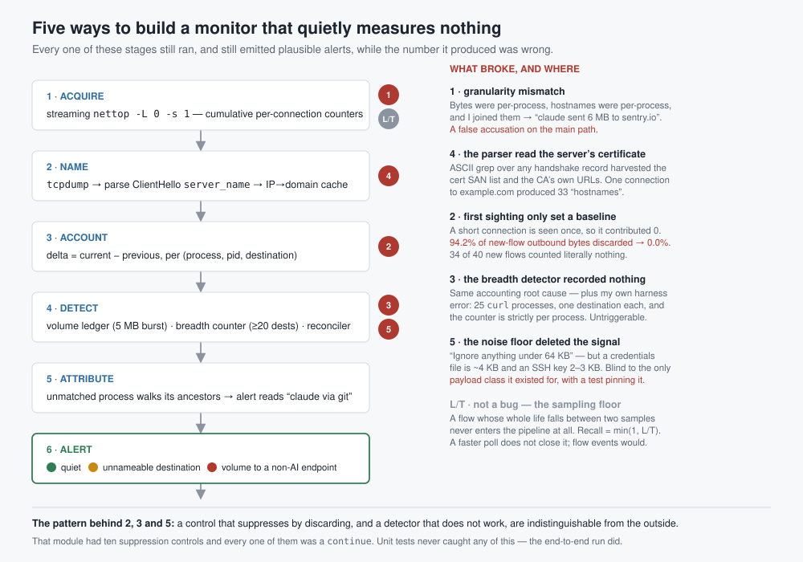

# Agent Egress Sentinel

A tiny menu-bar app that watches what your AI coding agents send out of your
Mac — and flags the Grok tell: an agent process pushing a large volume to a
destination that isn't a known AI endpoint.

**Metadata only. No TLS decryption. No root certificate.** It reads per-process
byte counts (`nettop`) and destination hostnames from the cleartext TLS SNI
(`tcpdump`). It never sees your payloads. It even logs its own update-check
connection — because a tool that watches egress should watch its own.

> **Status: research project, not a product.** Nothing is sold and no team
> edition is being built. The acceptance gates have **not** been run and the
> endpoint allowlist is still seed data, so the false-positive rate on your
> machine is unknown — **[PRE-FLIGHT.md](PRE-FLIGHT.md) is the honest inventory**
> of what has and has not been verified. Read it before you decide whether to
> trust an alert.

> Built in a weekend, after [cereblab's wire-level teardown](https://gist.github.com/cereblab/dc9a40bc26120f4540e4e09b75ffb547) ([repro harness](https://github.com/cereblab/grok-build-exfil-repro)) of
> Grok Build CLI silently uploading whole repos: 5.1 GB to a GCS bucket over a
> side channel while the model call was 192 KB. That 27,800× ratio is visible
> at the metadata layer — no payload needed. This shows it to you, live.



*Where this sits. The right-hand column is the load-bearing part: L1 is a v0 that is
off by default, and L4 does not exist here at all.*

### Why this isn't a niche worry

Nine days after that teardown (2026-07-12 → 07-21), OpenAI disclosed that a model under evaluation
broke out of its sandbox and [breached Hugging Face's production
infrastructure](https://simonwillison.net/2026/Jul/22/openai-cyberattack/) to
cheat on a benchmark — and nobody noticed for days. Thomas Ptacek's reading of
it ([2026-07-22](https://simonwillison.net/2026/Jul/22/thomas-ptacek/)):

> "I genuinely believe that if you took an open weights model from 2025 and built
> a pentest harness for it, it could do this kind of sandbox escape and scan/hack
> in most networks. This is only surprising because you assume OpenAI has sounder
> sandboxes."

That's the threat model, and note what it isn't: it isn't a prediction about
future frontier models. The capability is already commodity — the surprising part
is only that we assumed the containment was solid.

**Two honest limits on that framing, before you read further.**

First, we don't know why that incident went unnoticed. Public reporting
establishes a delay; it does not tell us what telemetry OpenAI had. One published
analysis offers a different explanation entirely — dozens of benchmarks running
concurrently with effectively unlimited token budgets, so the signal was drowned
rather than absent. We cite Ptacek for "the capability is commodity", which is
what he actually said, and nothing more.

Second, **this tool would not have caught that incident, even in principle.** It
decides "is this an agent" by matching a fixed token list against a process's own
command line. An internal evaluation harness matches nothing, so no amount of
traffic would have produced an alert. The incident is why we think the *problem
class* matters. It is not a demo of this program.

**And it doesn't contain anything.** Ptacek's argument points at containment
(default-deny egress); this is observation. Blocking on macOS means a
NetworkExtension — becoming the hardest thing on your machine to uninstall — and
that's a deliberate later step behind an explicit switch (see ROADMAP), not a
silent upgrade.

## Run (rough, on purpose)

```bash
pip install -r requirements.txt
python3 sentinel.py                          # menu-bar app
SENTINEL_IFACE=en0 sudo -E python3 sni_sniffer.py   # 2nd terminal: domains (one sudo)
```

macOS `tcpdump` often rejects `-i any` — set `SENTINEL_IFACE` (e.g. `en0`, or
`pktap`). The `sudo -E` preserves the env var and `SUDO_USER`, so both processes
share `~/.agent-egress-sentinel/`.

**macOS only to run, but no longer macOS-only in the code.** Everything above the
capture layer is portable and its tests pass on Windows; byte counts there work
too (`wincapture.py`, ETW, verified against a live capture). **What is missing is
a hostname source** — there is no `tcpdump` SNI equivalent wired up yet, so a
Windows run would resolve no domains and could only produce amber "unresolved",
never a red alert. Safe, but not yet useful.

One result from that work is worth reading next to the recall table below:
**Windows' natural byte source is event-driven, and `min(1, L/T)` does not bound
it** — 361 short-lived connections observed against 301 made. So that bound is a
property of the sampling tools macOS offers without a NetworkExtension, not of
metadata-layer observation. [PLATFORMS.md](PLATFORMS.md) has the measurements and
what the rest of the port costs.

### Before you ship: the one test that matters

The product IS the alert. Verify it end-to-end — do NOT publish until it passes.

The sentinel decides "is this an agent" from the **process's own argv**, so a bare
`curl` won't trigger (its argv has no agent token — that was a bug in an earlier
draft of this README). Give the uploader an agent-token name:

```bash
# ln -s, NOT cp: a *copied* system binary fails macOS code-signature validation
# and is killed on exec (SIGKILL / "Killed: 9"). A symlink executes the real,
# signed binary while argv[0] carries the token — verified on macOS 15.
ln -s "$(command -v curl)" /tmp/claude-egress-test     # argv[0] now contains "claude"
# with the sniffer running, upload enough to cross the 5 MB floor, throttled so it
# spans several ticks (see the caveat below — this part is load-bearing):
/tmp/claude-egress-test --limit-rate 3M -T some-50MB-file https://transfer.sh
```

Expect (sniffer running): one **red** alert naming `claude-egress-test` and
`transfer.sh` — not an IP, not a bystander. Sniffer off → **amber** "unresolved",
never a red IP accusation.

Timing caveat — read this one, it is not cosmetic. One long-lived `nettop -L 0
-s 1` streams samples; accounting runs once a second against the freshest values.
A flow we have never seen is treated as newly opened and its whole cumulative is
counted (that was a bug until 2026-07-27: the first sighting used to establish the
baseline and contribute **zero**, which discarded 94.2% of the outbound bytes of
new flows and left the breadth counter with 0 of 25 real destinations — that run
also drove its load with a loop over `curl`, i.e. 25 separate pids holding one
destination each, and the breadth counter is strictly per-pid, so it could not have
fired regardless; see ROADMAP). Two things still follow from sampling at all:

- **Recall is set by how long each connection lives, not by how many there are.**
  A connection alive over `[a, a+L]` is recorded only if a sample instant falls
  inside it, so with connection starts uncorrelated to sample phase, recall
  ≈ `min(1, L/T)` for sampling interval `T`. Measured directly — 57 distinct real
  remote destinations from a single long-lived process, `T` fixed at the shipped 1 s:

  | connection lifetime `L` | predicted `L/T` | measured recall |
  |---|---|---|
  | ~50 ms (open, send, close at once) | 5% | **5.8%** |
  | 300 ms | 30% | **36.8%** |
  | 500 ms | 50% | **54.4%** |
  | 1 s | 100% | **100.0%** |
  | 2 s | 100% | **100.0%** |
  | held open for the run | 100% | **100.0%** |

  

  **Prior art, so this is not read as a discovery.** `min(1, L/T)` is
  length-biased sampling / the inspection paradox from renewal theory, and
  "sampling under-represents short flows" is standard in the NetFlow literature.
  What is not standard is a working monitor whose author wrote the prediction
  down first, controlled `L`, built 57 ground-truth destinations, and published
  the table — including withdrawing a number they had already published. Same
  pattern holds for the other claims here: the argument that authorization
  cannot be inferred from observed traffic is [arXiv 2607.05518](https://arxiv.org/abs/2607.05518);
  declare-then-reconcile is in the behavioural-specification literature; and
  that a benchmark can silently measure nothing is
  [arXiv 2605.22568](https://arxiv.org/abs/2605.22568). **Every idea here has
  prior art. What is thin everywhere is the measurement.**

  The consistent overshoot below saturation is the per-connection handshake and
  request time (~50–70 ms) adding to `L`. **The consequence runs the opposite way
  from intuition: the faster the fan-out, the less of it we see** — and a scanner
  is fast. An earlier version of this section quoted "48% recall at 1 s" as though
  it were a property of the sampler. It is not. It was the recall of one workload
  whose connections happened to live ~0.5 s (`curl`, TLS included); the same code
  on the same machine gives 5.8% for a tight in-process loop and 100% for held-open
  sockets. **That 48% figure is withdrawn as a general number** — see ROADMAP for
  the correction and the harness bug that produced the earlier "0 of 25".
  We still ship the streaming reader at 1 s because it delivers a 1 s cadence at a
  sixth of the CPU (1.8% vs 10.7% of a core); nettop rejects a fractional `-s`, so
  0.5 s would mean relaunching one-shot at 23% of a core. But no achievable polling
  rate closes a 50 ms window — that needs flow open/close **events** (eBPF /
  NetworkExtension), which is a v1 item, not a tuning knob. Throttle any test
  transfer (`--limit-rate 3M`) so it spans a sample.
- **A connection sampled mid-handshake carries zero bytes and is discarded** by the
  `delta <= 0` guard. Measured exactly: in every row of the sweep above,
  (destinations seen) − (destinations counted) equalled the zero-byte count
  precisely (3, 1, 0, 0). Small (≤3 of 57) and it vanishes once `L` exceeds `T`.
- Bytes sent by connections that were **already open when the sentinel started**
  are not counted (the first tick only seeds). That is deliberate — otherwise
  every launch would fire red on your browser's existing sockets — but it means
  the tool reports egress *from now on*, not history.

The one `sudo` is the entire trust-ask: `tcpdump` needs BPF to read connection
metadata. Far smaller than the root-CA install a TLS-inspecting tool demands —
and we're open source, read the ~4,100 lines.



*Every one of those stages still ran, and still emitted plausible alerts, while the
number it produced was wrong. Full write-ups in ROADMAP.*

## What it does / doesn't

| Does | Doesn't (yet) |
|---|---|
| Per-process **per-flow** outbound *and* inbound bytes (nettop connection rows) | Decrypt anything |
| Destination domains from the **parsed `server_name` extension** — the ClientHello byte structure is walked, not tcpdump's ASCII rendering. Replayable offline: `SENTINEL_PCAP=file python3 sni_sniffer.py` reads a capture — no `sudo`, and since 2026-08-06 no `tcpdump` either, because `pcapreader.py` parses the pcap/pcapng container directly. That is how this path is tested against public datasets, and it runs on any OS | Block traffic (detection only) |
| Recover an SNI split across TCP segments (`SENTINEL_REASSEMBLE=1`), which is what a post-quantum ClientHello does when the stack emits its large key_share before `server_name` | Do that reassembly cheaply. BPF cannot express "the next segment of this stream", and a bulk upload's segments start with arbitrary ciphertext, so no first-byte test excludes them — reassembly mode must capture **all** outbound 443 traffic and hex-dump it. Measured amplification of `tcpdump -x`: **3.1–3.4×** the packet bytes as text, so a 6 MB/s upload becomes ~19 MB/s through the pipe. Off by default; measure your uplink first |
| — | **Survive an agent that knows it's there.** The menu-bar process runs as your user with no `launchd` job and no system extension (see Uninstall), so anything it watches can simply `kill` it. This is a *cooperative* observer: useful against over-collection, an unaware compromised agent, or accidental bulk upload — not against an agent actively evading it. Treating a silent sentinel as evidence of quiet is the mistake this row exists to prevent |
| Separate AI-endpoint bytes from non-AI bytes within one process | Name **HTTP/3 / QUIC (UDP 443)** destinations — nettop still counts the bytes, but there's no cleartext SNI, so QUIC-only exfil shows as **amber (volume visible, destination un-nameable)**, not red |
| Flag agent → non-AI-endpoint volume via a **capacity ledger** (leaky bucket per pid+dest: 5 MB burst fires instantly, sustained egress above 128 KB/s fills the bucket no matter how it's paced) | Catch **short-lived burst** exfil (spawn uploader, send, exit inside a tick), or a trickle paced **under the 128 KB/s drain rate** |
| Count distinct low-byte destinations per agent (≥20 in 5 min → amber). Destinations are keyed on the remote **IP**. **Verified firing on 57 real remote destinations** from one process whenever connections lived ≥300 ms | See a fan-out that is both **fast and small**. Firing needs `true_dests × min(1, L/T) ≥ 20`, so the real destination count required depends on how long each connection lives: **~20 at `L`≥1 s, ~37 at 500 ms, ~54 at 300 ms, ~345 at 50 ms** (derived from measured recall). 0 of 3 trials fired at ~50 ms even with 57 destinations. The miss band is therefore **small-N lateral movement**, not broad reconnaissance — see the note below the table. Bare SYN probes move ~0 bytes and never form a countable flow at any volume. Run `./accept.sh calibrate` before trusting the threshold |
| Menu-bar states: 🟢 quiet · 🟡 unresolved (run sniffer) · 🔴 confirmed non-AI | Resolve **shared front IPs** perfectly (Cloudflare/GCP → "likely") |
| Reconcile observed egress against **declared** activity (`activity.ndjson`), amber-only, **off unless fed** | Do that for traffic hidden *inside* a plausible declaration, or for a pid whose declaration carries no `target` (a wildcard that silences it), or when SNI did not resolve (an IP cannot match a declared host). A declaration is self-reported -- see the reconciliation section |
| Log its own update ping | Stop abuse of a **wildcard-allowlisted** host (e.g. attacker's `*.openai.azure.com` tenant — see below) |

**Two detector shapes, and how the second one got fixed.** Exfiltration is
*volume*-shaped — one destination, a lot of bytes — and that's the capacity
ledger. Scanning and lateral movement are *cardinality*-shaped — many
destinations, few bytes each — so no bucket ever fills and the ledger is blind to
them by construction (there's a unit test asserting exactly that). We added a
destination counter for that shape. Then we measured it, and it recorded nothing:

> One process, 25 distinct HTTPS destinations, all requests succeeded. Raw
> `nettop` surfaced 10 of the 25 flows; all 10 appeared in exactly one sample, and
> **all 10 contributed zero bytes**, so the counter ended the run with 0
> destinations. The pipeline emitted 28 positive-delta events for other processes
> during the same run, so it was alive — it just recorded none of these.

The cause was an accounting rule, not the sampler: a flow's first observation was
being used only to establish a baseline, and a probe's outbound bytes (~500) are
already final when it is first seen. A never-before-seen connection is now counted
in full, with a cold-start warm-up tick so launching the app doesn't dump your
browser's existing sockets as fresh egress. Re-measured on the same workload:
**11 of 12 surfaced destinations counted (was 0)**, and the discarded fraction of
new flows' outbound bytes went from **94.2% to 0.0%** over a 70-second window.

What that did *not* fix: recall is bounded by **how long each connection lives
relative to the sampling interval**, not by sampling frequency alone — see the
measured sweep in the timing caveat above. So the ≥20 threshold does not map to one
real destination count; it maps to a different one per lifetime (~20 at `L`≥1 s, ~37
at 500 ms, ~54 at 300 ms, ~345 at 50 ms). We are deliberately not retuning it
against a quiet machine; `./accept.sh calibrate` measures the benign ceiling under
your own real workload, and that plus the zero-false-positive run is what should set
it. (One short calibration run here peaked at 3 low-byte destinations for agent
processes and 14 across all processes — informative, not enough to retune on.)

**Which sizes actually fall in the gap** (revised 2026-08-01 — an earlier version of
this section left the impression that the detector is near-useless against scanning,
and that was too pessimistic in one direction and not specific enough in the other).
The requirement scales with 1/recall, so the question is how big real fan-outs are.
The only first-party number I have is from Anthropic's 2026-07-30 disclosure: in one
capture-the-flag run a model swept **roughly 9,000 targets** before compromising an
internet-facing application. At the worst recall measured here (5.8%, ~50 ms
connections) that is ~520 observed destinations — about **26× the threshold**. So
breadth on the scale of real reconnaissance clears the bar even in the worst regime.
Two honest caveats: that report does not say whether those 9,000 probes carried
application-layer payload, and if the sweep was bare SYN/connect it moves ~0 bytes
and stays invisible at *any* volume (the separate absolute blind spot above); and
n=1 incident is not a distribution. What is left as the real gap is **small-N**:
published multi-host red-team ranges are 22–50 hosts, which needs `L`≥1 s to fire and
misses at 300–500 ms. Lateral movement across a couple of subnets is the shape this
does not see — not a sweep.

It is also amber-only by design, and it stays that way even if recall improves:
"my agent contacted 40 hosts" is what a multi-URL research task looks like too. (An
earlier draft justified this by pointing at `npm install`; that justification was
wrong and is withdrawn — a measured 74-package install produced no countable
outbound flows at all, so it is not the lookalike we claimed. The multi-URL case
remains plausible and untested.)

**The up/down ratio, and why it is printed but never used as a rule**
(added 2026-08-02). `bytes_in` was in the nettop header all along, one column
over from `bytes_out`, and the code had never read it. It does now, so an alert
reads `sustained 12 MB up / 0.4 MB down` instead of just the upload. Gating is
untouched: only the outbound delta can raise or suppress a row, and there is a
test asserting that a pure download (0 bytes out) produces no alert at all while
a 900 MB download cannot damp one.

The reason it is context and not a rule is that measuring it broke the premise
it was supposed to serve. The intuition sounds obvious — *reading a web page
should not upload 5 MB* — and that is a **ratio**, not a volume. But on this
machine, 125 of 125 live flows carried inbound data and the ratios looked like
this:

| process | out | in | out/in |
|---|---|---|---|
| `com.crowdstrike` | 128.0 MB | 4.1 MB | **31×** |
| `kiro-cli-chat` | 30.4 MB | 1.1 MB | **26×** |
| `kiro-cli-chat` | 16.1 MB | 81 KB | **199×** |
| `kiro-cli-chat` | 8.1 MB | 40 KB | **201×** |
| `agent` | 12.1 MB | 628 KB | **19×** |

**Upload-skewed is the agent baseline, not an anomaly.** An agent pushes context,
files and diffs up and gets text back; 19× to 201× is idle-day normal. So "high
out/in means suspicious" is not a threshold that needs tuning — it is backwards.
Two side notes from the same measurement: the biggest talker on this machine is
not an AI agent, it is the EDR agent at 128 MB, so any volume-ranked detector
sees security software first; and at one decimal place in MB, everything under
~50 KB of download prints as `0.0 MB down`, which is most real agent flows.

**What I withdraw here is larger than the absolute threshold.** My first repair
was "use it relatively — alert on deviation from each (process, destination)
pair's own historical ratio." That does not survive either, and the reason is
worth being precise about, because it is not calibration. Whether a transfer is
*authorized* is not a function of the traffic. Ask an agent to bulk-POST a few
hundred records and the ratio deviates exactly as far as an exfil would; the two
are byte-identical at this layer. Volume, ratio, cardinality, destination — all
of them measure how *unusual* traffic is, and none of them can measure whether
it was *intended*, because intent is not present in the bytes. That makes the
false-positive floor of any L3-only rule equal to the legitimate variance of
what a user might ask for next, which for an agent is unbounded by design.

This is the concrete argument for the reconciliation layer described in
"why build the weak layer at all" — and also its ceiling. Comparing observed
egress against *declared* activity replaces an unanswerable question ("is this
volume unusual?") with an answerable one ("did anything declare this at all?"),
and the bulk-POST case then resolves correctly for a reason volume never could:
the declaration matches, so the size stops mattering. The floor does not
disappear, it becomes **enumerable** — OS telemetry, package managers, editor
sync, CDN redirect chains, connection reuse — a list you can subtract from,
rather than "whatever the user might legitimately do next", which you cannot.
And it stops where the draft already says it stops: a declaration is
self-reported, so this catches traffic with **no** declared counterpart, not
traffic hidden **inside** one. Same shape as the dead-man switch — it raises the
cost of evasion without closing the class. As of 2026-08-02 that reconciliation is **implemented, amber-only, and off
unless you feed it** -- see the next section for the contract and for the
three ways it loses. (An earlier version of this paragraph ended "none of
this exists in the code today"; it does now, and the sentence is corrected
rather than deleted so the order of events stays legible.)

## Reconciliation: the one check that is not a threshold (v0, amber only)

Every other detector here asks *is this traffic unusual?* -- volume, ratio,
cardinality, timing. That whole class is unanswerable at this layer, and not for
want of tuning: **whether a transfer was authorised is not a function of the
traffic.** Ask an agent to bulk-POST a few hundred records and the bytes are
identical to an exfil. The false-positive floor of any rule of that shape equals
the legitimate variance of what a user might ask for next, which for an agent is
unbounded by design.

So this asks a different question, one that *is* answerable: **did anything
declare this at all?** That is a set difference, not a threshold, and its
false-positive floor is *enumerable* -- OS telemetry, package managers, editor
sync, CDN redirect chains, connection reuse -- a list you can subtract from.

**Off unless you feed it.** No activity file, or one nothing has written to in
five minutes, means reconciliation is inactive and reports nothing. The
alternative -- treating absence of declarations as "everything is unexplained" --
turns a missing integration into an alert storm. Absence of L1 is not evidence
about L3.

**Turning it on.** The agent side appends one line per tool call to
`~/.agent-egress-sentinel/activity.ndjson`. For Claude Code there is a ready hook —
add this to `~/.claude/settings.json` and nothing else:

```json
{
  "hooks": {
    "PreToolUse": [
      { "matcher": "WebFetch|Bash",
        "hooks": [ { "type": "command",
                     "command": "python3 /ABS/PATH/TO/hooks/claude_code_declare.py" } ] }
    ]
  }
}
```

For anything else, the contract is two lines:

```python
from declare import declare
declare("fetch", target="https://docs.example.com/x", nbytes=len(body))
```

```bash
python3 declare.py fetch docs.example.com 2048   # from a shell hook
```

**What the shipped hook deliberately does not declare.** It writes a line only
when it can name a host — `WebFetch`'s url, or a URL / `user@host:` inside a
`Bash` command. A `Bash` call with no parseable host writes *nothing*, because a
declaration with no `target` is a wildcard that silences the pid, so a hook that
guessed would switch the check off while appearing to feed it. It also omits
`bytes`, since outbound size is unknown before the call, which per the contract
below skips the volume sub-check rather than inventing a number. Under-declaring
costs false positives — visible and enumerable. Over-declaring costs silence.

The pid it declares is the **agent's**, not the hook's: the reconciler matches
traffic from the declared pid or any descendant, and the hook is a child, so
declaring its own pid would match nothing at all while running perfectly.

The contract is five fields, three required:

| field | | |
|---|---|---|
| `ts` | required | float epoch seconds |
| `pid` | required | the declaring pid -- traffic from **any descendant** counts, so `kiro-cli` declaring covers `curl` transmitting |
| `tool` | required | free text, only used to make the alert readable |
| `target` | optional | host; a URL is reduced to its host **before writing**, so a token in a query string never reaches disk |
| `bytes` | optional | declared outbound size |

Why a contract and not a vendor transcript directory: those are undocumented and
change without notice, they differ per install, and reading them means reading
your entire conversation history to learn one thing.

**`bytes` is recorded, and never gates.** It does strengthen the check -- declare
2 KB, observe 8 MB to the same host, and the destination reconciles while the
magnitude does not, which is the case presence-only matching misses. But a report
needs *both* an 8x multiple *and* an absolute excess over 5 MB (the same floor
that fires a red), and declared sizes are **summed** across every matching
declaration, because one keep-alive connection carries many calls. If any
matching declaration omits `bytes`, the volume check is skipped entirely: the
declared total is unknown, and silence beats a number we invented.

**The byte floor is conditional, and that is a bug fix.** A flat 64 KB floor
shipped first, chosen to avoid drowning in per-process chatter. It was wrong: the
payloads this exists to catch are *small* -- `~/.aws/credentials` is ~4 KB, an SSH
private key 2-3 KB, a bearer token a few hundred bytes -- so the floor made the
tool blind to its own threat model, and a unit test asserted that blindness as if
it were the contract. Now: **no floor at all for a destination nothing in an agent
lineage has contacted before**, and the 64 KB floor only for destinations already
seen, which is where the benign small traffic actually is. Novelty is per-run with
a 120 s warmup, so a restart does not fire on your whole steady state; that also
means a restart erases the novelty baseline, which is an honest v0 limitation.

**Egress that cannot be attributed to an agent is now counted, not dropped.** It
is still never accused -- no destination, no pid, because naming a process we
cannot attribute is the wrong-accusation failure this tool guards against -- but
the count is reported. That silence was the exact mechanism that made
confused-deputy exfil invisible: ask a pre-existing daemon to fetch on your
behalf and its socket is in nobody's lineage.

**One imported invariant that a declaration cannot argue with.** Launch the agent
under a local interceptor and set `SENTINEL_PROXY=host:port`. Then *any*
non-loopback egress from an agent lineage is a finding regardless of what was
declared, and with no byte floor. This is lifted from the sibling
[`agent-mitm-audit`](../agent-mitm-audit) design, whose invariant is "a correctly
proxied agent tree has no non-loopback socket". It composes here for a reason
worth noticing: this tool already discards loopback (so a local ollama never
alarms), which is precisely what makes arriving at the reconciler *at all*
meaningful under proxy mode. Off unless you opt in.

**Three ways it loses, all deliberate and all asserted in tests:**

- **A declaration is self-reported.** This catches traffic with *no* declared
  counterpart -- an unaware leaky agent, vendor telemetry inside an agent
  process, an injected instruction that goes around the tool layer
  (`bash curl ...`). It does not catch traffic hidden *inside* a plausible
  declaration. Declared volume raises that cost (the declaration must be inflated
  too) without closing it. Same shape as the dead-man switch: evasion gets more
  expensive, the category stays open.
- **A declaration with no `target` is a wildcard for that pid.** It no longer
  silences a *first-time* destination outright, because that turned a documented
  defeat into an invisible off-switch -- one target-less `declare()` and the
  reconciler went quiet with no trace it had been muted. On a destination already
  seen it is still genuinely silent.
- **An unresolved destination is an IP**, which can never match a declared host,
  so the check degrades to pid-presence only.

**Two gaps a review panel found on 2026-08-03 that were undocumented and are
not closable at this privilege level.** First, **suspend-and-resume**: `SIGSTOP`
the sentinel, exfiltrate, `SIGCONT` within the 15 s dead-man staleness window --
no process dies, no restart, no recorded coverage gap. That is strictly stronger
than killing it, which at least leaves an absent icon behind. Second, the
**confused-deputy / sibling-process** case above. Both need an independently
privileged, event-driven observer and a tamper-evident off-host trail; the
direction standard security-event-logging guidance points, and this tool does not
meet it -- its evidence lives in locally writable files.

Amber only, and it stays that way: "nothing declared this" is a statement about
the *declarations*, not about the traffic. A partial hook, a tool that logs after
it returns, or a subprocess doing its own I/O all land here legitimately.

**Wildcard multi-tenant hole (honest):** `*.openai.azure.com` and
`bedrock-runtime.*.amazonaws.com` are shared/customer-subdomain endpoints.
Anyone can stand up their own tenant there, so a metadata-layer allowlist can't
tell your Azure OpenAI from an attacker's. This is exactly why content-layer
inspection is a *paid-tier* concern, not a free-tier promise.

## Is anyone actually forced to care? (a question, not a waitlist)

There is no paid product and no team edition being built. I don't know whether anyone
is under real pressure to answer "what did my agents send out", and the honest state of
the evidence is that comparable tools in this niche get close to zero uptake while the
same authors' cost-saving utilities get orders of magnitude more attention.

So this is a research question, asked plainly: **is something forcing you** — an audit
date, a customer security questionnaire, an incident you already had? If yes I want to
hear the specifics, because that is the evidence I currently lack. If nothing is forcing
you, that is also a useful answer and you should not install this.

→ Open an issue: **[what is forcing you, in one sentence](../../issues/new)**. No form,
no mailing list, nothing is collected. If you'd rather not say it in public, the commit
log has an address.

## Supported agents (detection scope)

A process is treated as an agent only if its command line contains one of these
tokens (whole-token match, so `ngrok` does **not** match `grok`):

`claude` · `cursor` · `codex` · `aider` · `grok` · `gemini` · `copilot` · `cline` · `kiro` · `windsurf`

`continue` was deliberately dropped — too common a word (`--continue`, path
segments) to match safely. To add an agent, add its token under `agents:` in
`ai_endpoints.yaml` (hot-reloaded, same governance as the endpoint list — no
Python edit needed) and run the harvest step for it so its legit endpoints land in
`ai_endpoints.yaml`. This list doubles as the harvest checklist.

**Subprocess traffic is attributed to the agent (since 2026-07-27).** A process
whose own name and argv carry no token walks up its ancestors: if an ancestor is an
agent, the flow is attributed to that agent and the alert says which child it came
from — `claude via git`. Before this, an agent shelling out to `git push`, `npm`,
`curl`, or a language runtime produced traffic attributed to nobody, which for any
agent that does its network work in subprocesses was most of its traffic. Verified
live: this repo's own tooling shows up as `kiro via python3.12`, and an MCP server
subprocess is likewise attributed back to `kiro`.

Mechanics and limits: parent pids come from `libproc` via `ctypes` (no `ps` fork,
and it works where spawning `ps` is blocked); the walk stops after 6 ancestors, at
`launchd`, or on a pid cycle; the confusable exclusion applies at every level, so an
`ngrok` ancestor is still not an agent. `argv` still needs `ps` — where that is
unavailable the walk falls back to process names only, which will miss agents that
run as a bare `node`.

## Contributing — the allowlist is the point

`ai_endpoints.yaml` is the community asset: the list of endpoints a legit AI
coding agent talks to. It's an **allowlist**, so a stale entry causes a false
positive on a new legit endpoint (not a missed threat) — maintaining it is
"keep up with legit endpoints," like a public-suffix / ad-filter list. PR a new
provider/host with a source link. (Loads with or without PyYAML installed.)

**A cooperative observer, and that word is load-bearing.** The menu-bar process runs
as your user. There is no `launchd` job, no privileged helper, no system extension —
which is exactly what makes it install shallow and uninstall clean, and is also why
any agent it watches can end it with one `kill`.

**So silence is now a signal.** The sniffer half runs under `sudo`, which means a
user-level agent cannot kill *it* — so it is the one process in a position to notice
that the app stopped. The app writes a heartbeat carrying its pid and process start
time; the sniffer checks it every 10 s and prints a loud `ALERT` (and logs it) when it
goes stale, including when the claimed pid is gone or has been reused by a different
process. On restart the app reports the coverage gap: *"nothing was watching for the
last N minutes."*

That covers a crash, an OOM kill, a quit, and a naive `kill`. It does **not** cover an
adversary that kills the app and keeps writing plausible beats — the heartbeat file is
owned by your user, so anything running as you can forge it. Closing that needs a
secret the app can use and the agent cannot read, which is impossible at equal
privilege; it needs the privileged-helper design in ROADMAP. `tests/test_deadman.py`
has a passing assertion for the forgeable case specifically so this is not mistaken
for tamper-proof. A green icon is still not proof of quiet — but an *absent* icon is
no longer silent.

**On the numbers in this README.** They come from a small number of runs on one
machine, and their evidence strength differs. The strongest is the connection-lifetime
sweep: the sampling interval was held fixed at the shipped 1 s while lifetime was
controlled directly, with 57 ground-truth destinations per point (peer IPs read from
`getpeername`, not assumed), a prediction stated before the run, and a live negative
control — but it is **one pass per lifetime, one machine, one network**. The earlier
cadence figures (25% / 48% / 72%) were 5 interleaved trials per condition with ranges
reported, but they varied the cadence while leaving connection lifetime uncontrolled,
which is exactly how 48% came to be mistaken for a property of the sampler; they are
retained only as a cadence-to-cadence comparison and must not be quoted as "the"
recall. The byte-accounting
figure (94.2% → 0%) is a single 35-sample window on one machine — and the 0% end is
constructive rather than estimated, since new flows are counted in full by design. The
SNI-noise figures are 2 junk of 4 extracted records before, 0 of 2 after, on three
public captures: directionally clear, far too small to extrapolate. An earlier revision
of these docs quoted that noise figure as 33%; the denominator was wrong and it is 50%.

## Uninstall

```bash
rm -rf ~/.agent-egress-sentinel      # that's it
```

No daemon, no `launchd` job, no kernel/system extension. It installs shallow, so
it uninstalls clean — which is exactly the difference from a root-CA / kext tool:
the thing that watches your egress shouldn't be the hardest thing to remove.

## License

Apache-2.0. The scanning approach owes a lot to Pipelock's "observer outside the
agent" framing.
